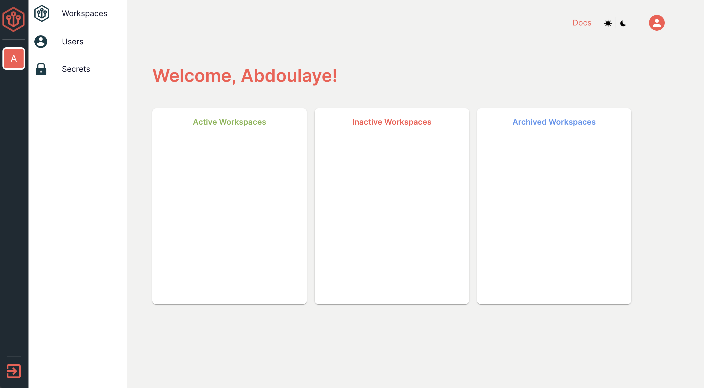

# Getting familiar with the Admin Dashboard

## The Dashboard at a Glance

<figure><figcaption></figcaption></figure>

1. Active Workspaces: These are the workspaces you or your colleagues are currently working in.&#x20;
2. Inactive Workspaces: These are workspaces that have been provisioned but are currently not in use.
3. Archived Workspaces: These are workspaces that have served their purpose (ie, deliverable has been completed) and are there for future reference.&#x20;

## Workspaces

<figure><figcaption></figcaption></figure>

The workspace tab is where you will find, manage, and create all of your workspaces. More on creating workspaces [here](getting-familiar-with-the-admin-dashboard.md#workspaces).

## Users

&#x20;

<figure><figcaption></figcaption></figure>

This is where you can invite, add, remove, and manage users on your team. By default, you are the team admin but that change depending on the deliverable you are working on.

<figure><figcaption></figcaption></figure>

## Secrets

<figure><figcaption></figcaption></figure>

Secrets are where you can setup permissions for your workspaces. This includes:

1. Generic APIs: This is where you define APIs that you want to propagate in your provisioned workspaces
2. SSH Keys: You can define the credentials for any machines you want to SSH into for your deliverable
3. Tailscale Authentication: You can authenticate into Tailscale for any sort of VPN you may need your workspace to access
