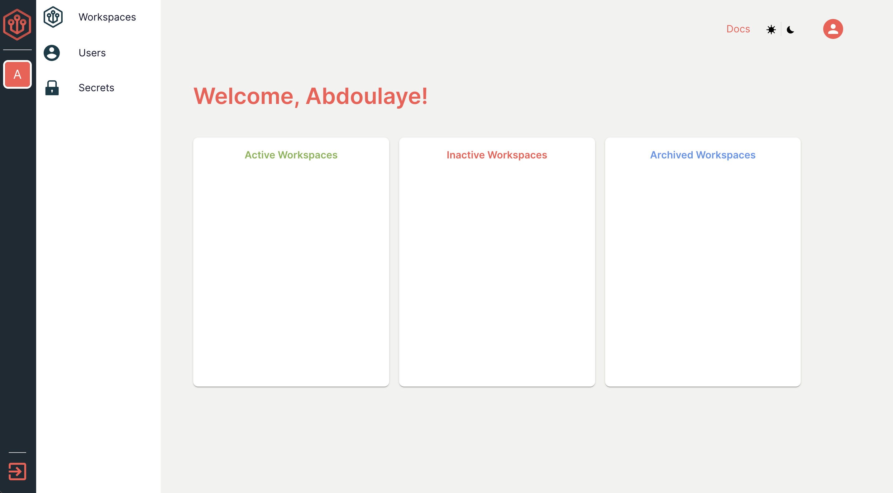

# Navigating an Enoki Workspace

.png>)

Once in the workspace, you will be greeted with your application side bar on the left, your NoVNC menu on the right, and your launcher at the bottom.

## The Application Sidebar

The application sidebar comes with the default packages going top down:

.png>)

1. Firefox
2. VSCode
3. Terminal
4. File Explorer
5. Screenshot Button
6. Window Termination Button

## The NoVNC Menu

The NoVNC Menu has the following:

.png>)

1. Extra Keys
   1. 
   2. These include:
      1. Control
      2. Alt
      3. Windows
      4. Tab
      5. Escape
      6. Control + Alt + Delete
2. Clipboard: This allows you to paste external text from your local machine into the Enoki Workspace
3. Full Screen: This allows you to go into full screen mode
4. NoVNC Settings
   1. .png>)
   2. These settings allow you to tweak your scaling mode, quality, and web socket settings
5. Lastly, you have the disconnect button to exit your session

## The Launcher

This is your standard launcher. It lets you see all of your installed applications and packages at a glance

.png>)
